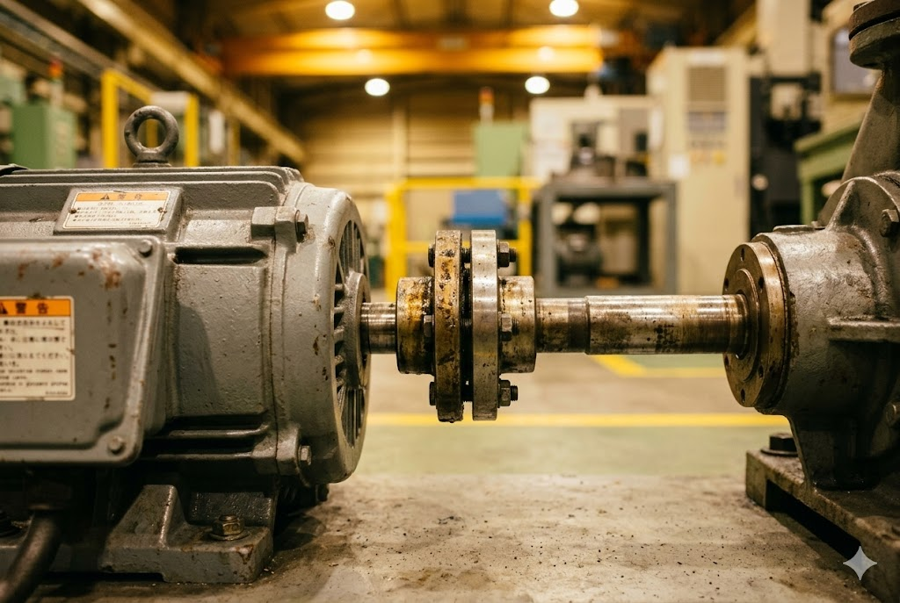

# 岩代工業株式会社 安全カバーページ 画像生成プロンプト集

> **対象ページ：** `safety-cover.html`
> **画像生成AI：** Midjourney v6 / DALL-E 3 / Stable Diffusion XL 対応
> **使用目的：** 各プロンプトをそのままAIに貼り付けてください。日本語注釈はAIには渡さず、英語プロンプトのみ使用します。

---

## 📋 画像一覧（挿入箇所別）

| # | ファイル名 | 挿入箇所 | 推奨サイズ | 形式 |
|---|-----------|---------|-----------|------|
| 1 | `hero-bg.jpg` | ヒーローセクション 背景 | 1920×1080 | JPG |
| 2 | `hero-cover-product.png` | ヒーロー右側カード上部 | 800×600 | PNG |
| 3 | `pain-exposed-machine.jpg` | 課題カード①（既製品が合わない） | 600×400 | JPG |
| 4 | `pain-inspection-doc.jpg` | 課題カード②（労基署指摘） | 600×400 | JPG |
| 5 | `pain-cost-estimate.jpg` | 課題カード③（コスト・品質） | 600×400 | JPG |
| 6 | `journey-step1-consult.jpg` | ジャーニーSTEP1（相談） | 600×400 | JPG |
| 7 | `journey-step2-survey.jpg` | ジャーニーSTEP2（現地調査） | 600×400 | JPG |
| 8 | `journey-step3-quote.jpg` | ジャーニーSTEP3（見積もり） | 600×400 | JPG |
| 9 | `journey-step4-fab.jpg` | ジャーニーSTEP4（製作） | 600×400 | JPG |
| 10 | `journey-step5-install.jpg` | ジャーニーSTEP5（納品・設置） | 600×400 | JPG |
| 11 | `features-workshop.jpg` | 特徴セクション 背景 | 1600×900 | JPG |
| 12 | `process-factory-floor.jpg` | 製作フロー セクション背景 | 1600×600 | JPG |
| 13 | `cover-showcase-sts.jpg` | 製品紹介ショーケース | 800×600 | JPG |
| 14 | `cover-showcase-iron.jpg` | 製品紹介ショーケース（鉄板） | 800×600 | JPG |
| 15 | `cta-factory-dramatic.jpg` | CTAセクション 背景 | 1920×900 | JPG |
| 16 | `contact-staff.jpg` | お問い合わせフォーム横 | 600×800 | JPG |

---

## 🖼 詳細プロンプト

---

### 1. `hero-bg.jpg`
**挿入箇所：** ヒーローセクション全面背景（濃紺オーバーレイの下に配置）

```
A dramatic wide-angle interior shot of a modern Japanese metal fabrication factory at dusk,
rows of CNC machines and welding stations with sparks flying softly, workers in safety helmets
and protective gear moving purposefully, warm amber sparks contrasting with cool blue overhead
lighting, shallow depth of field, cinematic lens flare, ultra-realistic industrial photography,
8k resolution, shot on Canon EOS R5, f/2.8, ISO 400, highly detailed
--ar 16:9 --style raw --v 6
```

> 💡 **日本語メモ：** ヒーロー背景。薄暗い工場内の雰囲気写真。darkオーバーレイで文字が読めるようにするため、やや暗めの画像が理想。

---

### 2. `hero-cover-product.png`
**挿入箇所：** ヒーロー右側のカードの最上部、実績数値の上に添える製品イメージ

```
A professional product studio photograph of a custom-made stainless steel safety guard cover
for industrial machinery, polished brushed SUS304 finish, rectangular with an access panel door,
mounting brackets visible, pure white background, soft box studio lighting, sharp focus,
product photography style, no text, transparent background preferred, ultra high resolution
--ar 4:3 --style raw --v 6
```

> 💡 **日本語メモ：** ステンレス製安全カバーの製品単体写真。白背景でPNG透過推奨。ヒーロー右カード上部に添える。

---

### 3. `pain-exposed-machine.jpg`
**挿入箇所：** ペインポイントカード①「既製品が合わない」の上部またはカード内背景

```
Close-up photograph of an industrial electric motor with exposed rotating shaft coupling,
no safety guard installed, showing dangerous pinch point, factory floor background slightly
blurred, warm industrial lighting, high detail metallic surface, realistic industrial hazard
photography, shallow depth of field, professional DSLR shot, no people in frame
--ar 3:2 --style raw --v 6
```

> 💡 **日本語メモ：** 露出したモーター軸の危険な状態を示す写真。カバーなしの状態を視覚的に表現。

---

### 4. `pain-inspection-doc.jpg`
**挿入箇所：** ペインポイントカード②「労基署指摘で急いでいる」の上部

```
A professional Japanese business scene: a safety inspector in a suit holding a clipboard
with inspection checklist forms, standing in front of industrial machinery in a factory,
serious expression, official documents visible, natural factory lighting, documentary-style
photography, no identifiable text on documents, slightly blurred background machinery
--ar 3:2 --style raw --v 6
```

> 💡 **日本語メモ：** 安全監査・労基署指摘のイメージ。監査員がクリップボードを持つ場面。書類内容は判読できないよう。

---

### 5. `pain-cost-estimate.jpg`
**挿入箇所：** ペインポイントカード③「コスト・品質・納期が全部心配」の上部

```
A flat lay photograph of engineering documents: a technical drawing blueprint, a price
quotation form, a calendar with a deadline marked in red, mechanical pencil and ruler,
on a light gray desk surface, clean and professional office lighting, top-down shot,
minimal style, no readable Japanese text
--ar 3:2 --style raw --v 6
```

> 💡 **日本語メモ：** 見積書・図面・カレンダーを並べたコスト検討イメージ。書類上の文字は判読不可でOK。

---

### 6. `journey-step1-consult.jpg`
**挿入箇所：** カスタマージャーニー STEP 1「相談」のサイドまたはカード内

```
A Japanese factory manager in a hard hat and safety vest looking at his smartphone while
standing near industrial equipment, natural factory lighting, candid documentary-style photo,
background showing conveyor machinery slightly out of focus, professional corporate
photography, 35mm lens look, warm ambient light
--ar 3:2 --style raw --v 6
```

> 💡 **日本語メモ：** 設備担当者がスマホで問い合わせをしているシーン。

---

### 7. `journey-step2-survey.jpg`
**挿入箇所：** カスタマージャーニー STEP 2「現地調査・採寸」

```
A skilled Japanese technician in blue work uniform using a steel tape measure to measure
industrial machinery components, crouching down to check dimensions, factory floor setting,
natural light plus overhead fluorescent, focused expression, measuring tools and notebook
visible, realistic working environment photography, no safety cover installed on machine yet
--ar 3:2 --style raw --v 6
```

> 💡 **日本語メモ：** 現場採寸シーン。作業員がメジャーで機械を計測している写真。

---

### 8. `journey-step3-quote.jpg`
**挿入箇所：** カスタマージャーニー STEP 3「見積もり・確認」

```
A Japanese engineer in a collar shirt reviewing a technical CAD drawing on a large monitor
at a clean office desk, paper blueprints spread out alongside, focused and professional
atmosphere, soft natural window light, modern engineering office setting, the screen shows
a simple bracket or enclosure 3D model, realistic corporate photography
--ar 3:2 --style raw --v 6
```

> 💡 **日本語メモ：** CADで設計・見積もりを作成しているエンジニアのデスクシーン。

---

### 9. `journey-step4-fab.jpg`
**挿入箇所：** カスタマージャーニー STEP 4「自社一貫製作」

```
A skilled Japanese metalworker MIG welding a steel safety guard in a workshop, bright blue
welding arc with sparks, protective welding mask, leather gloves, dark workshop environment
with dramatic lighting from the weld flash, industrial tools and sheet metal visible in
background, gritty realistic manufacturing photography, cinematic atmosphere
--ar 3:2 --style raw --v 6
```

> 💡 **日本語メモ：** 溶接作業の迫力ある写真。製作プロセスの核心を表現。

---

### 10. `journey-step5-install.jpg`
**挿入箇所：** カスタマージャーニー STEP 5「納品・設置」

```
Two Japanese maintenance workers in blue uniforms and helmets carefully installing a shiny
new stainless steel safety cover onto a conveyor or motor unit in a factory, using wrenches,
focused teamwork atmosphere, clean factory environment, the finished cover looks professional
and fits perfectly, realistic documentary-style industrial photography, bright factory lighting
--ar 3:2 --style raw --v 6
```

> 💡 **日本語メモ：** 2名の作業員が安全カバーを取り付けている完了直前の写真。

---

### 11. `features-workshop.jpg`
**挿入箇所：** 「選ばれる4つの理由」セクションの背景（暗めオーバーレイ使用）

```
Wide interior panoramic shot of a modern Japanese sheet metal fabrication workshop,
precision CNC laser cutting machines, press brakes, and welding stations visible,
clean and organized production floor, warm industrial lighting, no workers in frame,
emphasis on high-tech machinery and craftsmanship, ultra-wide lens, photo-realistic
industrial architecture photography
--ar 16:9 --style raw --v 6
```

> 💡 **日本語メモ：** 自社工場内部の全景。技術力と設備を視覚的にアピール。薄いオーバーレイで上にテキストを載せる。

---

### 12. `process-factory-floor.jpg`
**挿入箇所：** 「最短10日で納品できる製作フロー」セクションの背景帯

```
A long horizontal shot of a Japanese metal workshop production floor showing sequential
workstations from left to right: design desk, metal cutting station, welding bench,
finishing and painting area, quality inspection table, conveying the sense of a smooth
production line, wide-angle 2:1 aspect ratio, natural and artificial mixed lighting,
photojournalistic industrial photography
--ar 21:9 --style raw --v 6
```

> 💡 **日本語メモ：** 横長のプロセス背景画像。左から右へ製作工程が流れるような横長構図。

---

### 13. `cover-showcase-sts.jpg`
**挿入箇所：** 製品ショーケースセクション（追加推奨）または特徴カード①内

```
Professional product photography of a custom stainless steel industrial safety guard
enclosure installed on a belt conveyor system in a factory, brushed SUS304 surface,
hinged access door with a handle, mounting bolts visible, clean and industrial aesthetic,
soft directional studio lighting, sharp focus throughout, neutral factory background
--ar 4:3 --style raw --v 6
```

> 💡 **日本語メモ：** ステンレス製安全カバーの設置済み完成写真。コンベア等に取り付けたリアルな現場写真。

---

### 14. `cover-showcase-iron.jpg`
**挿入箇所：** 製品ショーケース（素材バリエーション紹介として13番と並列配置）

```
Product photograph of a black powder-coated steel safety guard cover installed over an
industrial electric motor shaft coupling, matte black finish, ventilation slots on sides,
padlock latch for lockout-tagout, realistic factory environment slightly out of focus
in background, professional industrial product photography, sharp and clean composition
--ar 4:3 --style raw --v 6
```

> 💡 **日本語メモ：** 鉄板塗装仕上げの安全カバー。ステンレスとの素材バリエーション比較用。

---

### 15. `cta-factory-dramatic.jpg`
**挿入箇所：** CTAセクション「今すぐ動き出しましょう」の全面背景

```
Dramatic wide-angle aerial interior shot of a vast Japanese heavy manufacturing facility
at golden hour, warm shafts of sunlight streaming through skylights onto the factory
floor below, workers as small silhouettes, long shadows and volumetric light rays,
cinematic anamorphic lens style, deep navy and gold color palette, ultra-realistic
photorealistic render, 8k, Sony A7S III shot
--ar 21:9 --style raw --v 6
```

> 💡 **日本語メモ：** CTAの一番重要な背景画像。映画的な迫力のある工場俯瞰。濃紺×金の色調でページのカラーに馴染む。

---

### 16. `contact-staff.jpg`
**挿入箇所：** お問い合わせフォームの左側または上部（信頼感を高めるスタッフ写真）

```
A friendly Japanese male engineer in his 40s wearing a clean blue work uniform with a
company logo badge, smiling warmly and looking at camera, sitting at a desk with a
laptop and technical documents, modern bright office environment, soft portrait lighting,
professional headshot style extended to 3/4 body, neutral light gray background,
corporate photography, highly realistic
--ar 3:4 --style raw --v 6
```

> 💡 **日本語メモ：** 問い合わせ担当スタッフの親しみやすいポートレート。フォームの左に配置して信頼感・人間味を演出。

---

## ⚙️ 使い方ガイド

### Midjourney の場合
1. Discord の Midjourney Bot に `/imagine` コマンドで上記プロンプトを貼り付け
2. `--ar` でアスペクト比が自動適用されます
3. 生成後、`U1〜U4` でアップスケールしてダウンロード

### DALL-E 3（ChatGPT）の場合
- `--ar` や `--v 6` のパラメータは不要（削除してから貼り付け）
- 「〇〇のサイズで生成して」と日本語で補足すると精度UP

### Stable Diffusion XL の場合
- ネガティブプロンプトに `text, watermark, cartoon, anime, blurry, low quality` を追加推奨
- CFG Scale: 7〜9、Steps: 30〜40 推奨

---

## 🔧 HTMLへの組み込み例

```html
<!-- ① ヒーロー背景 -->
<section class="hero" style="background-image: url('images/hero-bg.jpg'); background-size: cover; background-position: center;">

<!-- ② カード内画像 -->
<div class="pain-card">
  
  ...
</div>

<!-- ③ CTAセクション背景 -->
<section class="cta-section" style="background-image: linear-gradient(rgba(13,34,64,.85), rgba(26,74,138,.85)), url('images/cta-factory-dramatic.jpg'); background-size: cover;">
```

> フォルダ構成推奨：`iwashiro-landing-page/images/` に全画像を格納し、`safety-cover.html` から相対パスで参照

---

*作成日：2024 / 岩代工業株式会社 安全カバーページ用*
